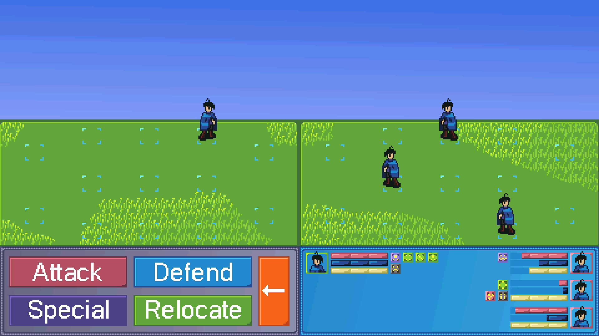

# Rise of Strife demo
Game demo created in Pygame by Joseury Rodriguez

Rise of Strife is a 2D, Turn-based, Tile-strategy, RPG game.

## Story
Rise of Strife is a game where you play as the main villain. Your goal is to irritate and enrage this story's hero via criminal actions. The cause for this activity is the story's hero neglecting the villain's town for a minor reason; this leads to the townsfolk dying from starvation and occasional bandit raids. This town would be the starting area for the game. As the story and game progress, more events and interactions unfold, and the player battles against rising rival gangs and resistances in the small isolated continent of Colleton.

## Battle System
   

  ### Extra HUD:

  **Portraits:**

  Green character frames indicate **allies**

  Red character frames indicate **enemies**

  There is a portrait of the character

  <br>

  **Bars:**

  Pink indicates health (max: 100)

  -  when health is 0, character faints until rejuvenated


  Blue indicates mana (max: 100)

  -  regenerates 20 mana per turn


  Yellow indicates stamina (max: 100)

  -  fully restores when player does not relocate a turn, this means they would be forced to not relocate after three turns
    *the purpose of this is to reward players that use relocating strategically*

  <br>

  **Squares:**

  Green indicates a buff

  Red indicates a debuff

  Purple indicates an ability/permanent buff

  Black indicates a curse/uncurable debuff
  -  you **must wait** for the listed amount of turns for a curse to disappear


  <br>
  <br>

  ### Battle options:
  

  **1. Attack**

  There are multiple attacks depending on character, they each have their uses including:

  -  Small Area of effect
  -  Small damage by piercing an object

  **2. Defend**

  _damage blocked depends on defense/resistance_

  -  Block for yourself
  -  Block for a nearby ally

  **3. Special**

  _each use different amounts of mana_

  Many different character specific moves, examples include:

  -  Extra Area of Effect
  -  Extra damage
  -  Buff allies
  -  Debuff enemies
  -  Pierce through objects
  -  Charge mana
    _mages only, restores 20/100 mana, character takes more damage this turn_
  -  or a mix of these effects

  **4. Relocate**

  _uses one stamina bar_

  _you can use another action after relocating_

  -  Move to a nearby tile
  -  Push a nearby ally away
  -  Pull a nearby ally towards you

  *there is also a __back button__ to return to previous menus*

  <br>
  <br>

  ### Stats
  Different characters have different stat spreads-- some have more attack, defense, etc.


  <br>

  **Stats include:**

  -  Attack

  Uses targets defense stat in damage calculation

  -  Magic

  Uses targets resistance stat in damage calculation

  -  Defense

  Physical defense

  -  Resistance

  Magic defense

## Unit tests
to run the unit tests in a command prompt in the source directory, do this

```
set PYTHONPATH=C:\Users\josec\Documents\GitHub\RiseofStrife\src
python model/modelTest.py
```
